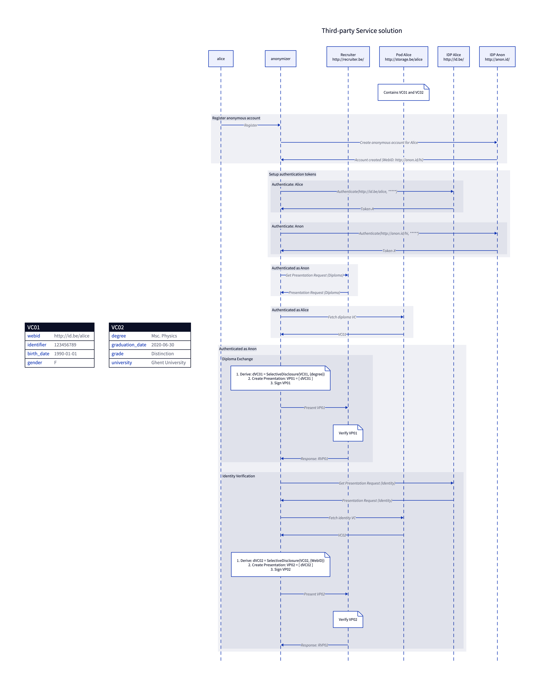
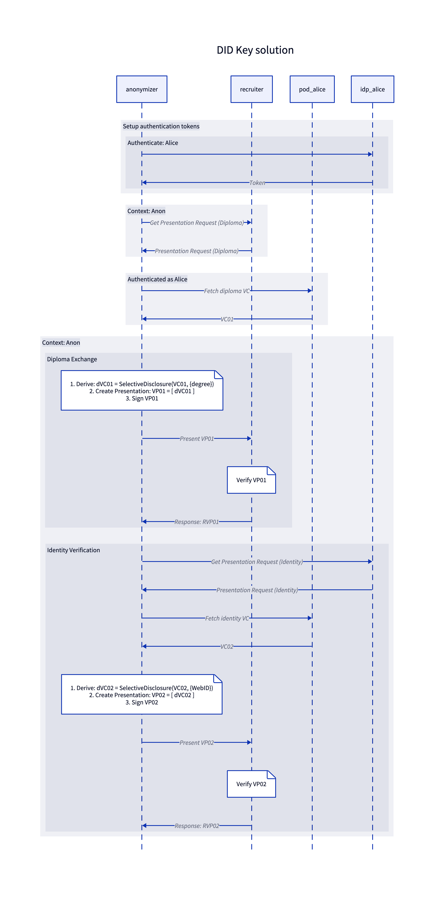
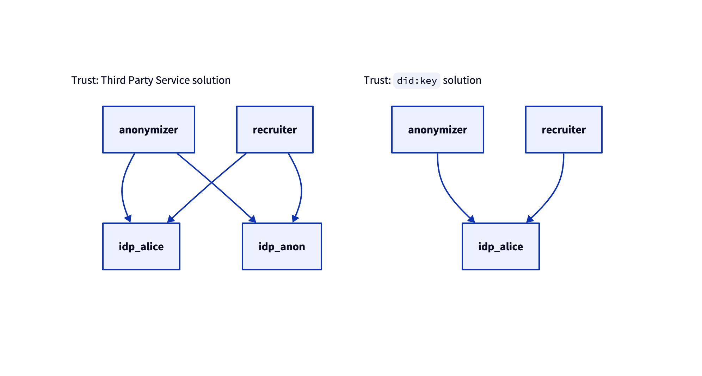

<!-- omit in toc -->
# Evaluation

This repository contains resources necessary for evaluating the Solid DIF PoC.

---
Table of Contents

- [Solutions](#solutions)
  - [Third-party service](#third-party-service)
  - [DID Key](#did-key)
  - [DID Peer](#did-peer)
- [Diagrams](#diagrams)
  - [Sequence](#sequence)
  - [Trust](#trust)
- [Usage](#usage)

## Solutions

This section discusses the solutions that will be evaluated.

### Third-party service

- [ ] Explain

### DID Key

- [ ] Explain
- [ ] How to add the DID interface to the recruiter service? </br> See: <https://w3c.github.io/did-spec-registries/#linkeddomains>

### DID Peer

DID Peer features are not supported by DID Key:

- Include multiple keys in the DID Document.
- Define services in the DID Document, e.g. DIDComm service endpoint.
- Use of multiple agents with the DID - each of which has its own keys.

---

- [ ] Research how to design a service with DID Peers
- [ ] Explain
- [ ] How to add the DID interface to the recruiter service? </br> See: <https://w3c.github.io/did-spec-registries/#linkeddomains>

## Diagrams

- [ ] Design of how CSS can be extended to support communication over one or more DID Methods (i.e. `did:key`, `did:peer`, etc.)

### Sequence

The following diagram represents
the sequence interactions between actors in case of the
[third-party service solution](#third-party-service).



The following diagram represents
the sequence interactions between actors in case of the
[DID Key solution](#did-key).



### Trust

The following diagram represents
the trust relations between actors for both solutions.



## Usage

- [ ] TODO

## Testing

```bash
npm install
```

### Recruiter service

Start the recruiter service as follows:

```bash
npm run eval:hacky:recruiter:start
```

Open a new shell and run the tests as follows:

```bash
npm run test:eval:hacky:recruiter
```

