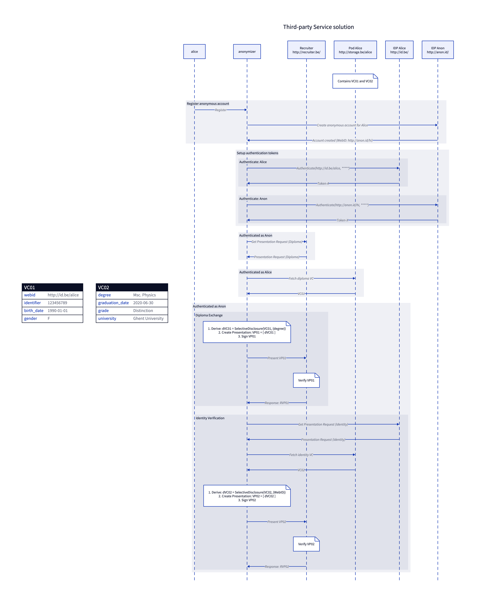
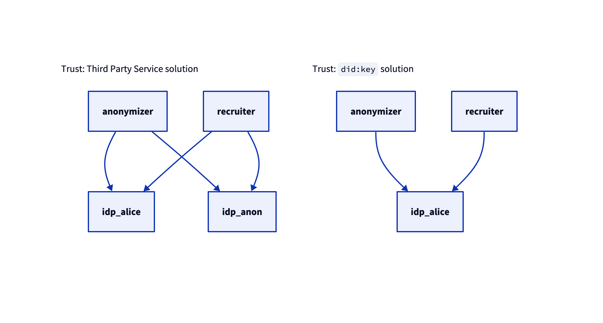

## Solutions

This section discusses the solutions that will be evaluated.

### Third-party service

- [ ] Explain

### DID Key

- [ ] Explain
- [ ] How to add the DID interface to the recruiter service?  
  See: <https://w3c.github.io/did-spec-registries/#linkeddomains>

### DID Peer

DID Peer features are not supported by DID Key:

- Include multiple keys in the DID Document.
- Define services in the DID Document, e.g. DIDComm service endpoint.
- Use of multiple agents with the DID - each of which has its own keys.

---

- [ ] Research how to design a service with DID Peers
- [ ] Explain
- [ ] How to add the DID interface to the recruiter service?  
  See: <https://w3c.github.io/did-spec-registries/#linkeddomains>

## Diagrams

- [ ] Design of how CSS can be extended to support communication over one or more DID Methods (
  i.e. `did:key`, `did:peer`, etc.)

### Sequence

The following diagram represents
the sequence interactions between actors in case of the
[third-party service solution](#third-party-service).

The following diagram represents
the sequence interactions between actors in case of the
[DID Key solution](#did-key).

### Trust

The following diagram represents
the trust relations between actors for both solutions.

